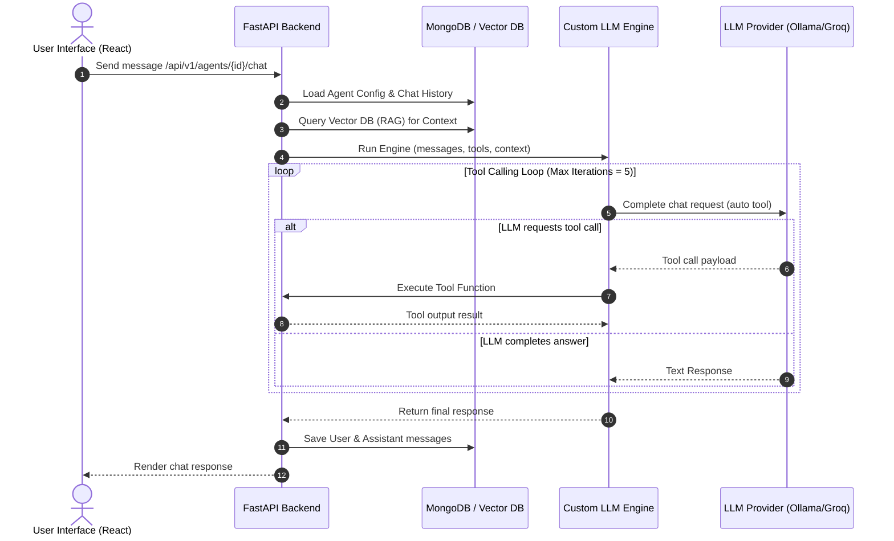

# 🌐 Multi-AI Agent Platform

[](https://www.python.org/)
[](https://fastapi.tiangolo.com/)
[](https://react.dev/)
[](https://www.mongodb.com/)
[](https://opensource.org/licenses/MIT)

An enterprise-ready, end-to-end **Multi-AI Agent Platform** designed to build, customize, configure, and orchestrate intelligent AI agents. The platform features a premium UI, user authentication, robust conversation management, dynamic custom API tools builder, and high-performance Retrieval-Augmented Generation (RAG) with local Vector DB support.

---

## ✨ Features

- 🤖 **Dynamic Agent Customization**
  - Instant deployment of agents configured with distinct system prompts, goals, instructions, models, and custom tools.
  - Multi-engine execution support: **Custom LLM Loop**, **LangChain Agent**, and **LangGraph StateGraph**.
- 🛠️ **Visual Tool Builder**
  - Build custom API tools dynamically through a user-friendly UI.
  - Generates OpenAI-compatible function calling schemas on the fly.
  - Safe, runtime tool execution for third-party API integrations.
- 📚 **Smart Knowledge Base (RAG)**
  - File uploader supporting PDFs, Text, CSV, etc.
  - Auto-chunking (recursive character split) and semantic embeddings generation using local/cloud models.
  - Seamless context retrieval injected directly into the agent's reasoning flow.
- 🧠 **Advanced Memory & Prompt Engine**
  - **Topic-Aware Memory**: Autodetects conversation context resets, standalone greetings (e.g., "Hi", "Hello"), and topic shifts using keyword-drift heuristics to prevent history pollution.
  - **Contextual Retention**: Seamlessly preserves conversation history and context window for pronouns and follow-up queries.
  - **Smart Tool Guidelines**: A revised system prompt that dynamically evaluates when to call external tools (e.g., real-time weather/stocks) and when to use internal knowledge base or pre-trained reasoning.
- 💬 **Persistent Conversational Threads**
  - Full session management with persistent message histories saved securely in MongoDB.
  - Interactive chat interface with real-time logging, token usage tracking, and multi-turn loops.

---

## 🏗️ Architecture Flow



---

## 🛠️ Tech Stack

- **Backend**: Python, FastAPI, MongoDB (Motor), Pydantic v2, OpenAI API Client, LangChain / LangGraph, Sentence-Transformers (Embeddings), PyPDF / Unstructured (Document Processing).
- **Frontend**: React, Vite, Tailwind CSS, Lucide Icons, Shadcn UI / Radix primitives.

---

## 📂 Project Structure

```
MULTI-AI-PLATFORM/
├── Backend/
│   ├── engines/             # Custom LLM, LangChain, and LangGraph Engine adapters
│   ├── models/              # Pydantic Database/ODM Models
│   ├── prompts/             # Modular system, RAG, and summarizer prompt builders
│   ├── rag/                 # Chunker, retriever, embedding pipelines, vector DB
│   ├── repositories/        # Database repository access layer
│   ├── routes/              # FastAPI Router endpoints (auth, agents, tools, chat, etc.)
│   ├── runtime/             # Engine orchestration runtime executor
│   ├── schemas/             # Request/Response Pydantic DTO validation schemas
│   ├── services/            # Chat, Authentication, and Conversation Service layers
│   ├── tests/               # Pytest suite (builtin tools, engine factory, APIs)
│   ├── utils/               # Constants, tool executor, dependency injection, logging
│   ├── main.py              # Application entrypoint
│   └── requirements.txt     # Python Dependencies
├── Frontend/
│   ├── public/              # SVGs, assets, icons
│   ├── src/
│   │   ├── api/             # Axios API client bindings
│   │   ├── components/      # Reusable Layouts, Sidebars, and UI primitives
│   │   ├── pages/           # Pages (Dashboard, Chat, Login, Agents, Tools, RAG)
│   │   ├── store/           # Global state/auth store
│   │   ├── index.css        # Base styles & Tailwind setup
│   │   └── main.jsx         # React application entrypoint
│   ├── package.json         # NPM script configurations
│   └── vite.config.js       # Vite build configurations
└── README.md                # Platform documentation
```

---

## 🚀 Getting Started

### Prerequisites

Ensure you have the following installed locally:
- **Python 3.10+**
- **Node.js 18+ & npm**
- **MongoDB** (running on `mongodb://localhost:27017`)
- **Ollama** (running on `http://localhost:11434`)

### 1. Backend Setup

1. Navigate to the backend directory:
   ```bash
   cd Backend
   ```
2. Create and activate a virtual environment:
   ```bash
   python -m venv venv
   # On Windows:
   .\venv\Scripts\activate
   # On Mac/Linux:
   source venv/bin/activate
   ```
3. Install dependencies:
   ```bash
   pip install -r requirements.txt
   ```
4. Create a `.env` file in the `Backend` directory:
   ```env
   MONGODB_URL=mongodb://localhost:27017
   DATABASE_NAME=ai_agent_platform
   JWT_SECRET=generate-a-secure-secret-key-for-development
   OLLAMA_BASE_URL=http://localhost:11434/v1
   GROQ_API_KEY=your_optional_groq_api_key
   ```
5. Run the development server:
   ```bash
   uvicorn main:app --reload --port 8000
   ```

### 2. Frontend Setup

1. Navigate to the frontend directory:
   ```bash
   cd ../Frontend
   ```
2. Install dependencies:
   ```bash
   npm install
   ```
3. Run the frontend development server:
   ```bash
   npm run dev
   ```
4. Open [http://localhost:5173](http://localhost:5173) in your browser.

---

## 🧪 Testing

The platform is backed by a comprehensive suite of unit tests validating tool execution, routing, factory adapters, and memory trimming behavior.

To run backend tests:
```bash
cd Backend
pytest -v
```

---

## 👥 Authors

- **Kirti Gami** - [GitHub Profile](https://github.com/Kirtigami20)

---

## 📄 License

This project is licensed under the MIT License. See the [LICENSE](LICENSE) file for details.
